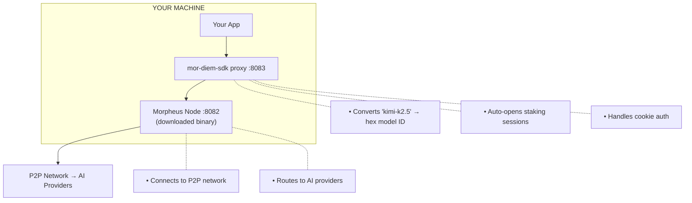

<h2 align="center">mor-diem-sdk</h2>

<p align="center">
  <strong>Stake MOR tokens, get AI.</strong>
</p>

<p align="center">
  
</p>

<table>
<tr valign="top">
<td width="50%">

<p align="center"><em>Wallet + network stats</em></p>
</td>
<td width="50%">

<p align="center"><em>50 active sessions</em></p>
</td>
</tr>
</table>

## Why this exists

Morpheus gives you decentralized AI inference for staking MOR tokens (fully refundable). This SDK makes it simple:

- **Human-readable model names** - use `kimi-k2.5` instead of `0xbb9e920d...`
- **Auto-staking** - first request opens a session automatically
- **Auto-renewal** - sessions renew before expiry
- **Cookie auth** - handled automatically, retries on stale cookies
- **OpenAI-compatible** - point any client at `localhost:8083`

Just:

```typescript
const response = await sdk.complete('Hello')
```

**Two pieces you run locally:**

| Piece | What | Ports | Source |
|-------|------|-------|--------|
| **mor-diem-sdk** | This repo. Proxy + wallet + CLI | 8083 | `bun run proxy` |
| **Morpheus Node** | Lumerin's binary. Connects to P2P network | 8082 (HTTP), 9081 (TCP) | [Download](https://github.com/MorpheusAIs/Morpheus-Lumerin-Node/releases) (~56MB) |

You run **both** on your machine. The SDK talks to the Morpheus Node HTTP API (8082), which talks to the P2P network.

**This SDK provides:**
- **OpenAI-compatible proxy** - point any client at localhost:8083
- **Terminal chat with sessions** - interactive CLI with model selection, memory, streaming
- **Auto-staking** - first request to a model opens a session automatically
- **Auto session renewal** - renews before expiry, no manual management
- **Auto cookie refresh** - detects stale auth, re-reads cookie, retries
- **Wallet SDK** - generate wallets, check balances, approve MOR
- **37 models** - list available, switch between, see stake requirements
- **Test any model** - quick completion testing via CLI

**Alternative:** Use [api.mor.org](https://api.mor.org) instead - pay USD, skip running anything locally.

### Why "diem"?

Not related to [Venice Diem](https://venice.ai), but inspired by the concept. Both are "stake to get inference" - you lock tokens for a period, get AI access, then get your tokens back.

| | Venice Diem | Morpheus (this SDK) |
|--|-------------|---------------------|
| **Stake model** | 1 diem = $1 of spend | Stake per model, per session |
| **Duration** | Burn as you use | Fixed period (up to 7 days) |
| **Access** | Concurrent, rate-limited | Single-lane 24/7 access |
| **Model costs** | Abstracted (diem absorbs differences) | Per-model staking |
| **Speed** | Could burn all diem in 5 seconds | Steady access for the period |

We liked the "diem" concept: stake → access → refund. Morpheus works differently, but the core idea is the same.

## Gotchas we handle

| Problem | Without SDK | With SDK |
|---------|-------------|----------|
| Model IDs | Look up hex IDs like `0xbb9e920d...` | Use names like `kimi-k2.5` |
| Sessions | Manually call `/blockchain/models/{id}/session` | Auto-opens on first request |
| Session expiry | Track expiry, manually renew | Auto-renews before expiry |
| Auth cookie | Read `.cookie` file, do Basic auth | Handled automatically |
| Stale cookie | Restart node, regenerate cookie | **Auto-detects and retries** |

**Status endpoint:** `GET /health` shows active sessions and their remaining time.

## Quick Start

```bash
# 1. Clone and install
git clone https://github.com/anthropics/mor-diem-sdk
cd mor-diem-sdk && bun install

# 2. Configure your wallet (12 or 24 word seed phrase)
cp .env.example .env
# Edit .env and set MOR_MNEMONIC="your twelve word seed phrase here"

# 3. Download Morpheus Node (~56MB binary)
bun run setup

# 4. Start everything (Morpheus Node + proxy)
bun run start

# 5. Chat!
bun run chat
```

**That's it.** The CLI walks you through model selection. You need:
- ETH on Base (for gas, ~$0.01)
- MOR tokens (for staking, ~2 MOR per model, refundable after 7 days)

**What `bun run start` does:**
1. Starts Morpheus Node (background, creates cookie)
2. Waits for node health
3. Starts SDK proxy (port 8083)
4. Reports available models

**Stop everything:** `bun run stop`

## How it works



**Proxy modes:**
- **Standalone** (current) - run `bun run proxy` as its own process
- **Embedded** - import into your app (same process, no HTTP overhead)

## SDK Usage

```typescript
import { MorDiemSDK } from 'mor-diem-sdk'

const sdk = new MorDiemSDK({
  mnemonic: process.env.MOR_MNEMONIC,
})

// Check balances
const balances = await sdk.getBalances()
console.log(`MOR: ${balances.morFormatted}`)

// Chat
const response = await sdk.complete('Explain quantum computing')
```

## CLI Commands

```bash
bun run cli              # Setup + chat
bun run cli chat         # Chat
bun run cli models       # List models
bun run cli wallet balance
```

## Models

37 models currently on-chain. List them:

```bash
bun run cli models       # CLI
curl localhost:8083/v1/models  # API
```

Models vary by provider availability, latency, and capability. We don't have enough data to recommend specific models - test with your use case.

## Configuration

| Variable | Description | Default |
|----------|-------------|---------|
| `MOR_MNEMONIC` | Your wallet seed phrase (12 or 24 words) | *required* |
| `MORPHEUS_ROUTER_URL` | Morpheus Node HTTP API | `http://localhost:8082` |
| `MORPHEUS_COOKIE_PATH` | Path to auth cookie | `./bin/morpheus/.cookie` |
| `MORPHEUS_PROXY_PORT` | SDK proxy port | `8083` |

**Note:** The Morpheus Node has two ports:
- **8082** - HTTP API (what we connect to)
- **9081** - TCP/P2P protocol (not HTTP)

## Tokens & Economics

Everything happens on **Base** (Coinbase L2, chain ID 8453).

> ⚠️ **Important:** MOR used to be on Arbitrum but moved to Base. Make sure your MOR and ETH are on the **Base network**, not Arbitrum or Ethereum mainnet.

| Token | Used For | Amount | Notes |
|-------|----------|--------|-------|
| **MOR** | Staking deposits | ~2 MOR per model | Refundable after 7 days |
| **ETH** | Gas fees | ~$0.01 per tx | For approvals, session opens |

**Getting MOR on Base:**
- [Aerodrome](https://aerodrome.finance/swap?from=eth&to=0x7431aDa8a591C955a994a21710752EF9b882b8e3) - Main DEX on Base
- [Uniswap](https://app.uniswap.org/swap?chain=base&outputCurrency=0x7431aDa8a591C955a994a21710752EF9b882b8e3) - Swap any token
- MetaMask - Built-in swap feature (select Base network)
- [Coinbase](https://www.coinbase.com/price/morpheus) - Buy directly, transfer to Base

**MOR is NOT spent.** It's a refundable deposit:
1. Lock MOR for 7 days
2. Use unlimited inference
3. MOR returns to your wallet

**Contract addresses (Base):**
- MOR Token: `0x7431aDa8a591C955a994a21710752EF9b882b8e3`
- Diamond Contract: `0x6aBE1d282f72B474E54527D93b979A4f64d3030a`

## Docs

- [Staking Guide](docs/staking.md)
- [Architecture](docs/architecture.md)
- [Troubleshooting](docs/troubleshooting.md)

## Lessons Learned (Feb 2025)

Things we discovered building this SDK. Morpheus is evolving fast, so this may be outdated.

**Port confusion is real:**
- 8082 = HTTP API (what you want)
- 9081 = TCP/P2P protocol (hitting this with HTTP fails silently)
- The Morpheus docs aren't clear about this distinction

**Cookie auth is mandatory:**
- The Morpheus Node creates a `.cookie` file on first run
- You must read this file and use Basic auth: `Authorization: Basic <base64(cookie)>`
- If the cookie is stale (node restarted), requests fail with "invalid basic auth"
- Our SDK auto-detects stale cookies and retries

**Sessions are on-chain, not ephemeral:**
- When you stake MOR for a model, it creates an on-chain session
- Sessions last 7 days and are fully refundable
- You don't re-stake every request - one stake = unlimited inference for 7 days
- Sessions can be renewed before expiry

**The network is real but small:**
- As of Feb 2025: ~24,000 MOR daily budget, only 3 active providers
- Provider availability varies - some models may timeout
- This is early infrastructure, not production-grade yet

**MOR is a deposit, not a payment:**
- You lock ~2 MOR per model for 7 days
- After the session ends, MOR returns to your wallet
- ETH is needed for gas (~$0.01 per transaction on Base)

## License

MIT - see [LICENSE](LICENSE)
