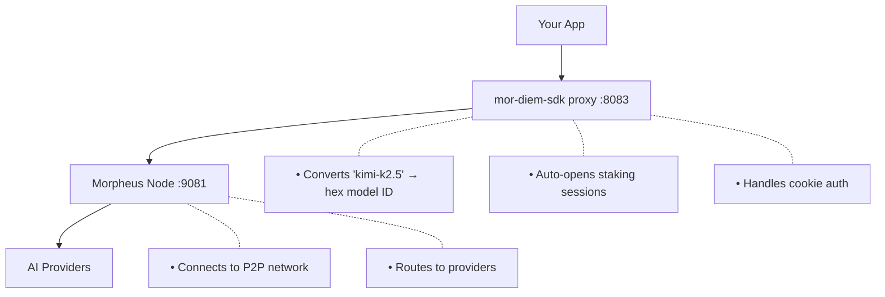

<h2 align="center">mor-diem-sdk</h2>

<p align="center">
  <strong>Stake MOR tokens, get AI. That's it.</strong>
</p>

<p align="center">
  
</p>

## Why this exists

You want to use [Morpheus AI](https://mor.org). To do that, you stake MOR tokens on **Base** chain for a session (7 days, fully refundable).

Morpheus's node requires hex model IDs, manual session management, and cookie auth. **mor-diem-sdk handles all of that** so you can just:

```typescript
const response = await sdk.complete('Hello')
```

**This is NOT:**
- The Morpheus gateway (api.mor.org) - that's pay-per-use USD
- The Lumerin router - that's the heavy 56MB binary
- A consumer node - that's Morpheus infrastructure

**This IS:**
- A drop-in OpenAI-compatible proxy
- Auto session/staking management (open, renew, track expiry)
- Wallet SDK (create, import, check balances, stake MOR)
- Model discovery (list available models, check stake requirements)
- CLI for setup and testing

### Why "diem"?

Not related to [Venice Diem](https://venice.ai), but inspired by the concept. Both are "stake to get inference" - you lock tokens for a period, get AI access, then get your tokens back.

| | Venice Diem | Morpheus (this SDK) |
|--|-------------|---------------------|
| **Stake model** | 1 diem = $1 of spend | Stake per model, per session |
| **Duration** | Burn as you use | Fixed period (up to 7 days) |
| **Access** | Concurrent, rate-limited | Single-lane 24/7 access |
| **Model costs** | Abstracted (diem absorbs differences) | Per-model staking |
| **Speed** | Could burn all diem in 5 seconds | Steady access for the period |

We liked the "diem" concept: stake → access → refund. Morpheus works differently, but the core idea is the same.

## Gotchas we handle

| Problem | Without SDK | With SDK |
|---------|-------------|----------|
| Model IDs | Look up hex IDs like `0xbb9e920d...` | Use names like `kimi-k2.5` |
| Sessions | Manually call `/blockchain/models/{id}/session` | Auto-opens on first request |
| Session expiry | Track expiry, manually renew | Auto-renews before expiry |
| Auth cookie | Read `.cookie` file, do Basic auth | Handled automatically |
| Stale cookie | Restart node, regenerate cookie | See [troubleshooting](docs/troubleshooting.md) |

**Status endpoint:** `GET /health` shows active sessions and their remaining time.

## Quick Start

```bash
# 1. Clone and install
git clone https://github.com/anthropics/mor-diem-sdk
cd mor-diem-sdk && bun install

# 2. Download Morpheus Node (required, ~56MB)
bun run setup

# 3. Start Morpheus Node (separate terminal)
~/.morpheus/proxy-router

# 4. Start the proxy
bun run proxy

# 5. Run CLI
bun run cli
```

The CLI walks you through wallet setup. You need:
- ETH on Base (for gas, ~$0.01)
- MOR tokens (for staking, refundable after 7 days)

## How it works



## SDK Usage

```typescript
import { MorDiemSDK } from 'mor-diem-sdk'

const sdk = new MorDiemSDK({
  mnemonic: process.env.MOR_MNEMONIC,
})

// Check balances
const balances = await sdk.getBalances()
console.log(`MOR: ${balances.morFormatted}`)

// Chat
const response = await sdk.complete('Explain quantum computing')
```

## CLI Commands

```bash
bun run cli              # Setup + chat
bun run cli chat         # Chat
bun run cli models       # List models
bun run cli wallet balance
```

## Models

37 models available. Recommended:

| Model | Time to First Token |
|-------|---------------------|
| `venice-uncensored` | ~350ms |
| `mistral-31-24b` | ~500ms |
| `qwen3-coder-480b-a35b-instruct` | ~680ms |
| `kimi-k2.5` | ~2s |

## Configuration

| Variable | Description |
|----------|-------------|
| `MOR_MNEMONIC` | Your wallet seed phrase |
| `MORPHEUS_ROUTER_URL` | Where the Morpheus Node binary is running (default: localhost:9081) |

## Chain

Everything happens on **Base** (Coinbase L2). You need:
- ETH on Base for gas
- MOR tokens on Base for staking

## Docs

- [Staking Guide](docs/staking.md)
- [Architecture](docs/architecture.md)
- [Troubleshooting](docs/troubleshooting.md)

## License

UNLICENSED
