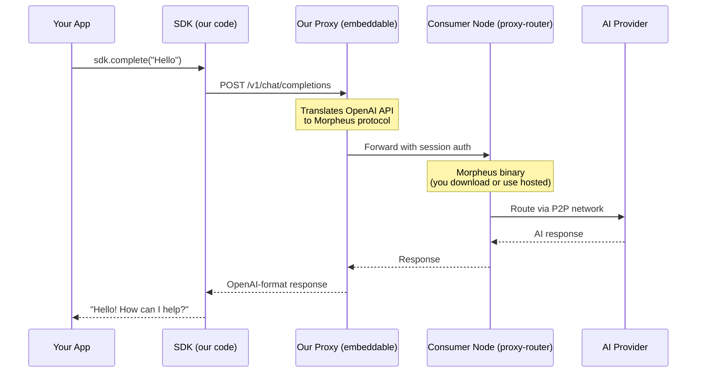
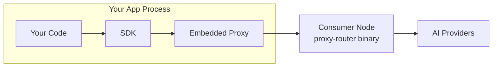

<h2 align="center">mor-diem-sdk</h2>

<p align="center">
  <strong>SDK and CLI for the Morpheus AI network</strong>
</p>

<p align="center">
  
</p>

## What This Does

1. **Stake MOR tokens** - Via CLI or programmatically in your app
2. **See available models** - 37+ AI models with live provider status
3. **Access AI** - OpenAI-compatible API, works with any client

Your MOR stake is a **refundable deposit** (not payment). Tokens lock for 7 days, then return to you.

## How Morpheus Works

See [Morpheus documentation](https://github.com/MorpheusAIs/Docs) for full details.

**Key terms:**
- [**Consumer Node**](https://github.com/MorpheusAIs/Morpheus-Lumerin-Node/blob/main/docs/04-consumer-setup.md) - Morpheus's `proxy-router` binary that connects to the network, manages sessions, stakes MOR, and routes inference to providers
- **Provider** - Runs AI models, earns MOR
- **Session** - Time-based rental (stake MOR for 7 days, get it back)

## What This SDK Provides

We are **NOT** a consumer node. We provide tools that **talk to** a consumer node:

| Component | What It Does | Footprint |
|-----------|--------------|-----------|
| **SDK** (`src/`) | TypeScript client for staking, models, inference | ~50KB |
| **Proxy** (`src/proxy/morpheus-proxy.mjs`) | Translates OpenAI API → Morpheus protocol | Single file, ~500 lines |
| **CLI** (`src/cli/`) | Command-line tools for setup and chat | Development only |

### How It Works



### Embedding the Proxy

The proxy is a **single JavaScript file** (`src/proxy/morpheus-proxy.mjs`). You can:

1. **Run standalone:** `bun run proxy` (port 8083)
2. **Embed in your app:** Import and run in same process
3. **Skip entirely:** Point SDK directly at a consumer node (loses OpenAI compatibility)



## Your Options

| Setup | What You Run | Consumer Node | Cost |
|-------|--------------|---------------|------|
| **[api.mor.org](https://api.mor.org)** | Nothing | Run by Morpheus | Pay USD |
| **SDK + local consumer node** | Our proxy + [proxy-router](https://github.com/MorpheusAIs/Morpheus-Lumerin-Node/releases) | You run locally | Stake MOR |
| **SDK + remote consumer node** | Our proxy only | Point to remote | Stake MOR |

**Typical setup:** Run our proxy (embeddable) + download [proxy-router](https://github.com/MorpheusAIs/Morpheus-Lumerin-Node/releases) (~56MB binary).

## Installation

### As a Dependency

```bash
npm install mor-diem-sdk
```

Then import in your code:

```typescript
import { MorDiemSDK } from 'mor-diem-sdk'

const sdk = new MorDiemSDK({
  mnemonic: process.env.MOR_MNEMONIC,
})

// Check balances
const balances = await sdk.getBalances()
console.log(`MOR: ${balances.morFormatted}`)

// Make inference call
const response = await sdk.complete('Hello from my app!')
```

---

## Quick Start (Local Development)

### First Time? Just Run:

```bash
bun install
bun run cli
```

The CLI will guide you through wallet setup. You'll need:
- ~0.01 ETH on Base (for gas, ~$0.02)
- ~5 MOR tokens (for deposits, ~$3 at current prices)

### Already Configured?

```bash
# Interactive chat
bun run cli chat

# Quick inference
bun run cli complete "Hello, world!"
```

### Programmatic Usage

```typescript
import { MorDiemSDK } from 'mor-diem-sdk'

const sdk = new MorDiemSDK({
  mnemonic: process.env.MOR_MNEMONIC,
})

const response = await sdk.complete('Explain quantum computing')
console.log(response)
```

## Architecture

```
Your App → Proxy (embeddable) → Router → AI Providers
              ↓
         OpenAI-compatible API
```

| Component | What It Does | You Run It? |
|-----------|--------------|-------------|
| **Proxy** | OpenAI API → Morpheus protocol | Yes (embed or standalone) |
| **Router** | Blockchain ops, provider routing | Optional (can use remote) |

### Embedding the Proxy

The proxy is just `src/proxy/morpheus-proxy.mjs` - pure Node.js. Options:

1. **Standalone:** `bun run proxy` (port 8083)
2. **Embedded:** Import and run in your app's process
3. **Remote:** Point to someone else's proxy

### Router Options

| Option | Setup | Use Case |
|--------|-------|----------|
| **Remote router** | Set `MORPHEUS_ROUTER_URL` | Simplest - someone else runs it |
| **Local router** | Download [Lumerin binary](https://github.com/MorpheusAIs/Morpheus-Lumerin-Node/releases) | Full control, true P2P |

See [architecture.md](docs/architecture.md) for deep dive.

## Model Status

> **Last tested:** February 26, 2026 | **31 of 37 working** | [Full Dashboard](docs/model-status/)

| Status | Count |
|--------|-------|
| ✅ Working | 31 |
| ⬜ No provider | 5 |
| ❌ Provider error | 1 |

### Recommended Models

| Model | Speed | Notes |
|-------|-------|-------|
| `venice-uncensored` | ~350ms | Fastest |
| `mistral-31-24b` | ~500ms | Fast, reliable |
| `qwen3-coder-480b-a35b-instruct` | ~680ms | Best for coding |
| `kimi-k2.5` | ~2s | Deep reasoning |
| `hermes-3-llama-3.1-405b` | ~800ms | Large model |

Add `:web` suffix for web search: `mistral-31-24b:web`, `glm-4.7:web`, etc.

### Run Your Own Tests

```bash
bun run scripts/test-models.ts
```

Results saved to `docs/model-status/` with timestamps.

## CLI Commands

```bash
# Setup & Chat
bun run cli              # First-run setup + chat
bun run cli chat         # Interactive chat
bun run cli setup        # Re-run setup wizard

# Wallet
bun run cli wallet generate      # Generate new wallet
bun run cli wallet balance       # Check balances
bun run cli wallet approve       # Approve MOR for deposits

# Inference
bun run cli models              # List models
bun run cli complete "message"  # Quick test
bun run cli health              # Check connectivity
```

### Chat Commands

| Command | Description |
|---------|-------------|
| `/help` | Show commands |
| `/model` | Switch model |
| `/wallet` | Check balance |
| `/status` | Session info |
| `/clear` | Clear history |
| `/exit` | Exit |

## Configuration

Config is stored in `~/.mor-diem/config` (created by setup wizard).

### Wallet Options

| Option | Use Case |
|--------|----------|
| Mnemonic | Dev/testing - derive multiple wallets from one seed |
| Private Key | Production - single wallet, direct control |

```typescript
// Mnemonic - derive wallet 0, 1, 2... from one seed
new MorDiemSDK({ mnemonic: '...', walletIndex: 0 })

// Private key - single wallet
new MorDiemSDK({ privateKey: '0x...' })
```

### Environment Variables

| Variable | Description |
|----------|-------------|
| `MOR_MNEMONIC` | BIP39 seed phrase |
| `MOR_PRIVATE_KEY` | Single wallet private key (alternative to mnemonic) |
| `MOR_WALLET_INDEX` | Derivation index for mnemonic (default: 0) |
| `MOR_RPC_URL` | Base RPC URL (default: public RPC) |
| `MOR_BASE_URL` | Custom proxy URL |

## Documentation

**Getting Started:**
- [Staking Guide](docs/staking.md) - How deposits work, pricing, what to expect
- [Troubleshooting](docs/troubleshooting.md) - Common issues and fixes

**Reference:**
- [Model Status](docs/model-status.md) - Live dashboard of all 37 models
- [SDK API](docs/sdk-api.md) - Full TypeScript API, balances, error handling
- [Architecture](docs/architecture.md) - System components and data flow

**Deep Dives:**
- [Builder Guide](docs/builder-guide.md) - Running your own consumer node
- [Pricing Comparison](docs/pricing-comparison.md) - Morpheus vs traditional APIs
- [Lessons Learned](docs/lessons-learned.md) - Integration insights

## Running Locally

```bash
# 1. Start Morpheus Node (download from Morpheus releases)
./morpheus-router  # Port 9081

# 2. Start proxy
bun run proxy  # Port 8083

# 3. Your app connects to http://localhost:8083
```

**Morpheus Node:** Download `proxy-router` from [Morpheus releases](https://github.com/MorpheusAIs/Morpheus-Lumerin-Node/releases).

**Or skip local router:** Set `MORPHEUS_ROUTER_URL` to point to a remote one.

## Security

- **Never commit mnemonics** - Use `.env` (gitignored) or environment variables
- **Use a dedicated wallet** - Don't use your main holdings for inference
- **Approve reasonable amounts** - Don't use MAX_UINT256 for approvals

## Tests

```bash
bun test                     # Run all tests
bun test tests/wallet.test.ts    # Wallet tests only
bun test tests/integration.test.ts  # Live network tests
```

### Test Coverage

| Suite | Description |
|-------|-------------|
| `wallet.test.ts` | BIP39 mnemonic generation, validation, HD derivation |
| `sdk.test.ts` | SDK initialization, configuration, static methods |
| `client.test.ts` | Client creation, available models |
| `integration.test.ts` | Live tests: balances, proxy health, model inference |

### Integration Tests

Integration tests run against live Base mainnet and the local proxy. They require:
- `MOR_MNEMONIC` environment variable set
- Local proxy running (`bun run proxy`)

Tests automatically handle:
- Checking wallet balances
- Listing available models
- Testing inference on multiple models
- **Price monitoring:** Flags if staking costs exceed 2 MOR per model

## License

UNLICENSED (Proprietary)

---

**Disclaimer:** This SDK interacts with blockchain smart contracts. Always test with small amounts first.
